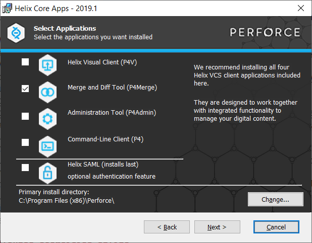

# Ingeniería del Sofware 3 - Práctico

Repositorio Git de Ingeniería del Software 3 - Año 2019

## Trabajo Práctico 1 - Git Básico

### 1- Objetivos de Aprendizaje
 - Utilizar herramientas de control de configuración de software
 - Familiarizarse con los comandos más utilizados
 - Configurar el repositorio principal de cada alumno para la materia

### 2- Unidad temática que incluye este trabajo práctico
Este trabajo práctico corresponde a la unidad Nº: 4

### 3- Consignas a desarrollar en el trabajo práctico:
  - Los ejercicios representan casos concretos y rutinarios en uso de este tipo de herramientas
  - En los puntos donde corresponda, proveer los comandos de git necesarios para llevar a cabo el punto.
  - Cuando se especifique alguna descripción, realizarlo de la manera más clara posible y con ejemplos cuando sea necesario.

### 4- Desarrollo:

#### 1- Instalar Git
Los pasos y referencias asumen el uso del sistema operativo Windows, en caso otros SO seguir recomendaciones específicas.

  - Bajar e instalar el cliente git. Por ejemplo, desde https://git-scm.com/
  - Bajar e instalar un cliente visual. Por ejemplo, TortoiseGit para Windows o SourceTree para Windows/MAC:
    - https://tortoisegit.org/
    - https://www.sourcetreeapp.com/
    - Lista completa: https://git-scm.com/downloads/guis/

#### 2- Crear un repositorio local y agregar archivos
  - Crear un repositorio local en un nuevo directorio.
  - Agregar un archivo Readme.md, agregar algunas líneas con texto a dicho archivo.
  - Crear un commit y proveer un mensaje descriptivo.

#### 3- Crear un repositorio remoto
  - Crear una cuenta en https://github.com
  - Crear un nuevo repositorio en dicha página (vacío)
  - Asociar el repositorio local creado en el punto 2 al creado en github.
  - Subir los cambios locales a github.

#### 4- Familiarizarse con el concepto de Pull Request
Para algunos de los puntos proveer imágenes.

  - Explicar que es un pull request.
  - Crear un branch local y agregar cambios a dicho branch. 
  - Subir el cambio a dicho branch y crear un pull request.
  - Completar el proceso de revisión en github y mergear el PR al branch master.

#### 5- Mergear código con conflictos
  - Instalar alguna herramienta de comparación. Idealmente una 3-Way:
    - P4Merge https://www.perforce.com/downloads/visual-merge-tool. Se puede omitir registración. Instalar solo opcion Merge and DiffTool.
    
    - ByondCompare trial version https://www.scootersoftware.com/download.php
  - Configurar Tortoise/SourceTree para soportar esta herramienta.
    - https://www.scootersoftware.com/support.php?zz=kb_vcs
    - https://medium.com/@robinvanderknaap/using-p4merge-with-tortoisegit-87c1714eb5e2
  - Clonar en un segundo directorio el repositorio creado en github.
  - En el clon inicial, modificar el Readme.md agregando más texto.
  - Hacer commit y subir el cambio a master a github.
  - En el segundo clon también agregar texto, en las mismas líneas que se modificaron el punto anterior.
  - Intentar subir el cambio, haciendo un commit y push. Mostrar el error que se obtiene.
  - Hacer pull y mergear el código (solo texto por ahora), mostrar la herramienta de mergeo como luce.
  - Resolver los conflictos del código.
  - Explicar las versiones LOCAL, BASE y REMOTE.
  - Pushear el cambio mergeado.

#### 6- Algunos ejercicios online
  - Entrar a la página https://learngitbranching.js.org/
  - Completar los ejercicios **Introduction Sequence**
  - Opcional - Completar el resto de los ejercicios para ser un experto en Git!!!

#### 7- Crear Repositorio de la materia
  - Crear un repositorio para la materia en github. Por ejemplo **ing-software-3**
  - Subir archivo(s) .md con los resultados e imágenes de este trabajo práctico. Puede ser en una subcarpeta **trabajo-practico-01**

### Referencias

- https://try.github.io/
- https://github.github.com/training-kit/downloads/es_ES/github-git-cheat-sheet.pdf
- https://github.com/adam-p/markdown-here/wiki/Markdown-Cheatsheet